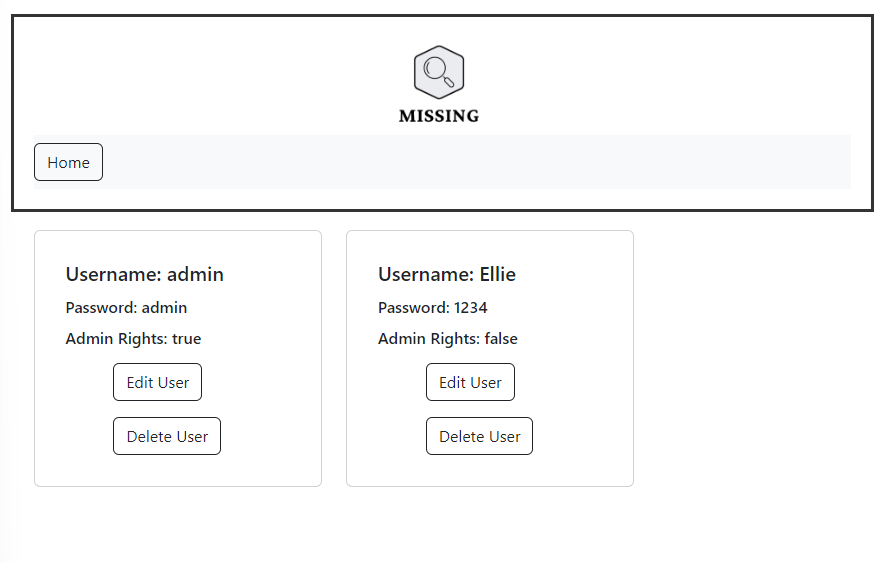

# 1. Introduction:

## 1.1 Purpose:

The purpose of this document is to define and describe the system architecture and the system requirements specification of this project in section 2 and define and describe how to use the app in section 3.

## 1.2 Scope:

The scope of this project is to create a missing persons database that law enforcement and private investigators will be able to add missing persons to. The public will be able to view information of the missing persons.

## 1.3 Intended Audience:

Users of the system include:

- Law Enforcement and Private Investigators: Will be able to add missing persons, delete entries when found, update information of entries.
- Public users: Will be able to view information.

## 1.4 Intended Use:

The following are some use cases for the project:

## 1.5 Definitions and Acronyms:

- LE: Law Enforcement
- PI: Private Investigator
- MP: Missing Persons

## 1.6 Existing Software:

Similar software exists through the SAPS, however due to resource constraints the database is not always up to date. With the current database, only SAPS is able to add a MP on the database whereas with this system a PI or Le not linked to SAPS will also be able to add a MP on the database.

# 2. System Requirements and Functional Requirements:

## 2.1 System Architecture:

2.1.1 The system will be developed using the MERN stack:
2.1.1.1 MongoDb - A NoSQL database. Used to store the users details as well as the MP on the database.
2.1.1.2 Express.js - Server-side Node framework. Handles the HTTP requests and responses
2.1.1.3 React- Front-end javascript library. Used for the front-end of the system.
2.1.1.4 Node.js - Javascript environment. Express.js runs inside Node.js server.

2.1.2 The website will be styled using React Bootstrap. It is easy to use as it can be used directly on elements and components in React.

## 2.2 Deployment:

The app will be deployed to GitHub and Vercel. Vercel is used to deploy the app because no configuration is required.

## 2.3 Functional Requirements:

2.3.1 LE and PI will be able to do the following functions:

- Log into website
- Add a MP to the database
- Update information about a MP
- Delete a MP from the database

  2.3.2 The public will be able to:

- Log into website
- View Information from the MP database

### 2.4 Non-Functional Requirements:

- A large capacity of users logged in at a time must be accommodated
- Security on the database must be secure to avoid the tampering with MP information
- The searching function must give a result within 5 seconds
- Information must only be stored once in the database
- Downtime after a failure should not exceed 3 hours

# 3. How To Use and Test The App:

## 3.1 Installing, Testing and Running App on Local Machine:

### 3.1.1 Installing the App:

3.1.1.1. Copy the files to a project folder.
3.1.1.2. Navigate to the "backend" directory of the project.
3.1.1.3. To install the node modules, type "npm install" in the command line.
3.1.1.4. Navigate to the "frontend" directory of the project.
3.1.1.5. To install the node modules, type "npm install" in the command line.

### 3.1.2 Testing the Code:

### 3.1.2.1 Testing the Backend (Express App) Code:

1. Navigate to the backend directory of the project.
2. Type "npm install request --save" into the command line to install the request package.
3. Type 'npm install --save-dev mocha chai' into the command-line to install mocha and chai.
4. To run the test type "npm test" into the command line.
5. The screenshot below should appear in the terminal:
   

### 3.1.2.2 Testing the frontend (react) code:

1. Navigate to the frontend directory of the project.
2. Install the react-test-renderer for rendering snapshots by typing "npm add --dev react-test-renderer" into the command line.
3. To run the tests: Type "npm test" in the command line.
4. The screenshot below should appear in the terminal:
   

### 3.1.3 Running the App:

1. Navigate to the "backend" directory of the project.
2. To start the server, type "npm start" in the command line.
3. Navigate to the "frontend" directory of the project.
4. To start the server, type "npm start" in the command line.
5. The app runs on: http://localhost:3000

### 3.1.4 Measures Taken to Ensure the Security of the App:

1. Helmet was installed to secure the Express app (backend).
2. JWT authentication for users to access data
3. No external API keys were dealt with.

## 3.2 How to Use the App:

3.2.1 Logging In

1. If the user is not registered; they can enter a username and a password and then click the "Create New User" button to register
2. If the user is registered; they enter their username and password and click the "Login" button

3.2.1 Admin Users

1. The admin homepage contains the list of missing persons, each with an "Updat" and "Delete" button and three Navigation Buttons in the Header. These buttons are "Add New Missing Person", "View Users" and "Logout".
   

2. The "Add New Missing Person" button navigates to a form that the admin user can enter the details of a new missing person.
   

3. The "View User" buton navigates to the list of users (displaying their username, password and if they have admin rights) with buttons to "Edit User" or "Delete" a user.
   

3.1 The "Edit User" button allows the admin to change a users admin rights.

3.2 The "Delete User" button deletes the user

4. The "Update" button on each MP will navigate to a form populated with the Mps details. This can be updated and saved to the database by clicking the update button.
   

5. The "Delete" button on each MP deletes that specific MP.

3.2.2 Users

1. The user homepage contains a list of the MPs and a "Contact Us" and "Logout" button
   

2. The "Contact Us" button takes the user to a form to send their information and a message.
   

### 3.3 Link to the deployed app

## GitHub

[GitHub Link](https://github.com/ShaySN29/MERN-app---Missing-Person-Database.git)
